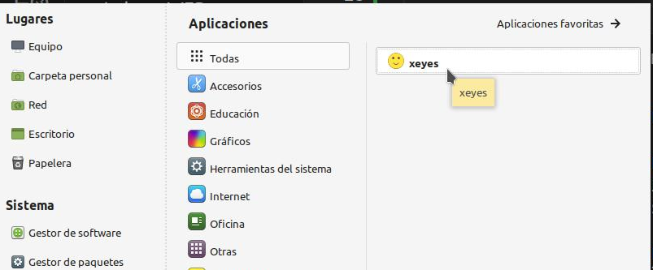

# Lanzador de aplicaciones

## Crea tu primer lanzador en tres pasos


1. Necesitamos una **aplicación**. Por ejemplo, xeyes, `/usr/bin/xeyes`
2. Necesitamos una **icono**. Selecionamos el icono .  [".png](preferences-desktop-emoticons-icon.png) y lo situamos en `/usr/share/icons`
3. Creamos el **archivo .desktop** para el lanzador
```sh
sudo vi /usr/share/applications/org.lasenia.xeyes.desktop
```

```
[Desktop Entry]
Type=Application
Name=xeyes
Exec=/usr/bin/xeyes
Icon=/usr/share/icons/preferences-desktop-emoticons-icon.png
```

4. Comprobamos en el menu de aplicaciones que nos aparece




---

## Qué son

Tanto el entorno de escritorio KDE como el GNOME han adoptado un formato similar para los archivos de configuración que describen cómo se iniciará un programa en particular, cómo aparece en los menús, etc.
En freedesktop se puede encontrar toda la información. [https://specifications.freedesktop.org/desktop-entry-spec/desktop-entry-spec-latest.html](https://specifications.freedesktop.org/desktop-entry-spec/desktop-entry-spec-latest.html)

# Consideraciones sobre su nomenclatura

* Los archivos de entrada del escritorio deben tener la extensión .desktop
* Siguen el formato inverso a los servidores DNS. El nombre de dominio debe ir seguido del nombre de la aplicación. Por ejemplo, si el propietario de example.org escribe "Foo Viewer", puede elegir el nombre org.example.FooViewer, lo que dará como resultado un archivo llamado org.example.FooViewer.desktop.

# Dónde se guardan los lanzadores

* Para aplicaciones compartidas con todos los usuarios

```sh
/usr/share/applications/
```

* Para aplicaciones solo para un usuario local `<user>`

```sh
/home/<user>/.local/share/applications/
```

* Además si queremos el lanzador en el escritorio podemos copiar el archivo en

```sh
/home/<user>/Escritorio
```

# Formato mínimo
    [Desktop Entry]
    Type=Application
    Name=nombre

* **Type** define 3 tipos de entradas de escritorio: Application, Link y Directory
* **Name** define el nombre de la aplicación

# Formato básico

    [Desktop Entry]
    Type=Application
    Name=nombre
    Exec=ruta al ejecutable de la app
    Icon=ruta al icono

* **Icon** Icono que se mostrará para el lanzador. Si el valor es una ruta absoluta, se utilizará el archivo proporcionado. Si el nombre no es una ruta absoluta entenderá que es el nombre de un tema.
  Podemos crear nuestro propio icono o elegir uno diponible. El tamaño mínimo recomendado es de 48x48px, el icono utilizado en el ejemplo es de 128x128px. Podemo encontrar iconos en https://www.iconarchive.com/tag/desktop-files

  Dependiendo si la aplicación es para usuario local o para todos podemos guardar el icono en `/usr/share/icons` o en `~/.icons`.
* **Exec** .Programa para ejecutar. Es necesario para que aparezca en el listado grafico de aplicaciones, en el menú. Si el programa requiere archivos/url adjuntos podemo utilizar parametros. [información detallada](https://specifications.freedesktop.org/desktop-entry-spec/latest/ar01s07.html)

# Formato medio

    [Desktop Entry]
    Type=Application
    Name=nombre
    Exec=ruta al ejecutable de la app
    Icon=ruta al icono
    Name[ca]=Idioma en castellano
    Name[ca@valencia]= valenciano
    Name[en_GB]=Idioma en ingles
    Comment=Acceso a la app
    Comment[ca]=Acceso a la app
    Comment[ca@valencia]=Accés a la app
    Comment[en_GB]=app access 

# Ejecutar xdg-open (*por ampliar)

xdg-open abre un archivo o URL en la aplicación preferida del usuario. Si se proporciona una URL, la URL se abrirá en el navegador web preferido del usuario. Si se proporciona un archivo, éste se abrirá en la aplicación preferida para archivos de ese tipo. xdg-open admite URL de archivos, ftp, http y https.

* xdg-open es para uso únicamente dentro de una sesión de escritorio.
* No se recomienda utilizar xdg-open como root.

```
#!/usr/bin/env xdg-open
   [Desktop Entry]
```
